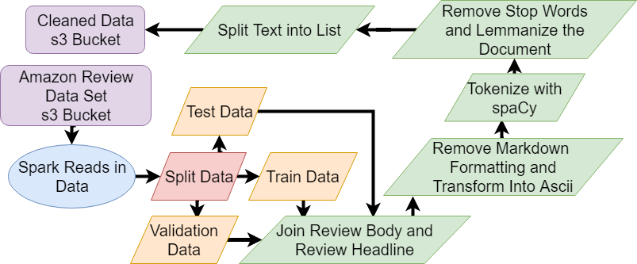

# Review Scores From Written Reviews

## Motivation and Project Explanation

For this project, I decided to use NLP and RNN's to predict a user given review score from the users' written review. In order to do this, I used the Amazon review dataset and used the Book product category to build and test the model. This data set was made up of a lot of user metadata and product data but I decided to only look at the Review Body, Review Headline, and Star Rating columns to build the model.

For EDA please refer to [this other project of mine](https://github.com/Aidan-Jared/NLP-Data-Featurization) but for this project, I was dealing with heavily imbalanced data.

## Project Overview

- Read Data in Through Spark
- Clean Text Through Spacy
- Build Word2Vec on the training set
- Use Word2Vec embeddings and LSTM to predict user scores
- Develop Flask App

## Text Cleaning

In order to do this project, I needed to read in the data through Spark and s3 then clean the text in Spark with user-defined functions and save the resulting data frames to s3 for later access. In order to accomplish this, I tried using an AWS EMR but ran into problems when bootstrapping the instances so I ended up using a docker image on an EC2 instance and changing Sparks executor memory to prevent memory overflow errors.

The function I wrote to clean the text used Beautiful Soup and Unicode to remove formatting and Spacy with the en_core_web_sm model as the tokenizer. The documents ended up being a combination of the review headline and review body which were the two text columns of the dataset

```python
def text_cleaner(Doc):
        if Doc is not None:
            Doc = ' '.join(BeautifulSoup(Doc).findAll(text=True))
            try:
                Doc = unidecode.unidecode(codecs.decode(Doc, 'unicode_escape'))
            except:
                Doc = unidecode.unidecode(Doc)
            Doc = re.sub("’", "'", Doc)
            Doc = ' '.join([contraction_mapping[t] if t in contraction_mapping else t for t in Doc.split(" ")])
            Doc = nlp(Doc)
            final_tokens = []
            for t in Doc:
                if t.is_space or t.like_num or t.like_url or t.is_stop:
                    pass
                else:
                    if t.lemma_ == '-PRON-':
                        final_tokens.append(t.text)
                    else:
                        sc_removed = re.sub("[^a-zA-Z]", '', t.lemma_)
                        if len(sc_removed) > 1:
                            final_tokens.append(sc_removed)
            return ' '.join(final_tokens)
        else:
            return Doc
```

This code takes each document removes any markdown formatting and turns all Unicode into ascii then replaces all contractions with the full explanation. The resulting string is then read into spaCy where it tokenized. I then run through the tokens and remove whitespace, numbers, URLs, and stop words from the document and then return lemmatized words with cases preserved. Then using a premade spark function I split the strings into lists for the word2vec and predictive models down the line. This results in the following transformation:


I then applied a random split to the Spark data frame and got a train, validation, and testing set to work with for the rest of the project. With this done I exported these data frames to an s3 bucket for later use.



## Word2Vec

For data featurization, I decided to do a Word2Vec model due to an understanding of the process and familiarity with Gensim. Word2Vec is an unsupervised learning technique of embedding a word into a dense float vector where the vector contains context about the word. The model is built in what is called the skip-gram method where a context window moves across the string and tries to predict the word in the middle of the window. After this process is completed, the calculated weights become the Word2Vec vector.

After some testing and checking, I found that these settings:

```
min_count: 15 #Amount of times a word needs to appear to be part of the model
window: 4 #The context window that is used to predict each word
epoch: 300
size: 300 #The ending size of the vectors
``` 

worked the best and produced the best embeddings as you can see here:

|Original Word|Most Simular|Second Most Simular|Third Most Simular|Forth Most Simular|Fifth Most Simular|
|--------|------|------|------|-----|------|
|fiction|Nationally|Blackoaks|appreciators|Perspectives|TSNOTD|
|fantasy|manipulatively|Palacios|Oregan|precisly|Auel|
|romance|jb|Absorb|Aishling|deem|Institutionalizing|
|religion|frei|Hadoke|Cariou|malapropisms|conceited|
|history|Promoters|cockamamie|aspiration|dustbin|Undercurrents|

## Predictive Model

To build my predictive model I decided to look at sentiment analysis Neural Nets as a base because review scores can be seen as a type of sentiment. In order to apply to Word2Vec model, the first layer of my model was an embedding layer to which I added in the Word2Vec weights and I then made that layer untrainable. This layer then went into an LSTM and then a dense layer with a tanh activation function into a single dense output with a relu activation. I then rounded the results and found the MSE of the model.

In order to make the model work, I looked at the training data and found the largest string of the data and set that to be the length of all my vectors so that I could capture all the context of each sentence. After this, my model replaced all strings with an integer index that corresponded with a dictionary entry and then fed the data into my model.


My model ended up looking like this


```
Layer (type)                 Output Shape              Param #
=================================================================
embedding_1 (Embedding)      (None, None, 300)         12360900
_________________________________________________________________
lstm_1 (LSTM)                (None, 75)                112800
_________________________________________________________________
dense_1 (Dense)              (None, 20)                1520
_________________________________________________________________
dense_2 (Dense)              (None, 1)                 21
=================================================================
Total params: 12,475,241
Trainable params: 114,341
Non-trainable params: 12,360,900
_________________________________________________________________
```

But sadly, this model did not work out as I wanted it to. The model made some improvements from the first to second epoch, but there was no change in the training loss and the model tends to predict only a single value for all inputs.


## Acknowledgments

- Galvanize Instructor Team
- The spaCy deep learning [tutorial](https://github.com/explosion/spacy/blob/master/examples/deep_learning_keras.py)

## Flask app

As part of this project, I developed a flask app inside a docker container so anyone can run the model and play around with it. You 
can pull it with the following command:

```
docker pull aidanjared/reviewpredictor:latest
docker run -p 80:5000 aidanjared/reviewpredictor:latest
```
